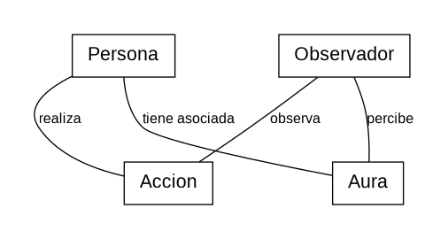

# Reto 001 – Modelado
## Escenario: Farmear aura

### Modelo

Se entiende **farmear aura** como realizar acciones que provocan una percepción social más positiva sobre una persona.

Una `Persona` realiza una `Accion`, un `Observador` puede observarla y, a partir de esa percepción, asociar un determinado `Aura` a la persona.

### Glosario

- **Persona:** individuo que realiza acciones.
- **Accion:** comportamiento realizado por una persona.
- **Observador:** persona que presencia o conoce una acción.
- **Aura:** percepción social que los demás tienen sobre una persona.

### Supuestos

- El aura se interpreta como una percepción social.
- Una misma acción puede ser valorada de forma diferente por distintos observadores.
- Una acción puede aumentar, disminuir o no modificar el aura percibida.
- El contexto puede influir en cómo se interpreta una acción.

### Decisiones de modelado

`Aura` no se considera únicamente una propiedad objetiva de `Persona`, porque depende de cómo los demás perciben sus acciones.

Se incluye `Observador` porque una misma acción puede producir percepciones distintas en personas diferentes.

Por tanto, **farmear aura** consiste en realizar acciones que tienden a mejorar la percepción social que los demás tienen sobre una persona.
