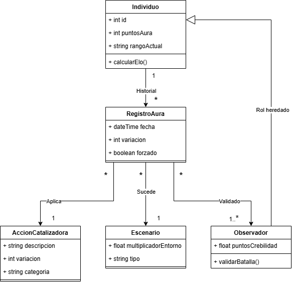

1. Diagrama de Clases

2. Glosario:

-Individuo: Entidad que participa en un evento.

-RegistroAura: La transacción de un evento específico que alteró el puntaje del individuo.

-AccionCatalizadora: El catálogo que define el acto cometido y su valor base.

-Escenario: El entorno físico o digital donde ocurre la acción, definiendo su nivel de exposición pública.

-Observador: Testigo presencial necesario para que el evento tenga validez.

3. Supuestos Adoptados:

-Validación de Puntaje: El aura requiere validación de terceros. Un evento sin observadores tiene un valor nulo debido a que no se puede validar.

-Penalizaciones: Si el atributo booleano forzado es verdadero, la lógica de negocio reduce drásticamente el impacto positivo o lo vuelve negativo.

-Sistema de Rangos: Los puntosAura determinan un rangoActual estructurado en una tierlist. Este estatus se recalcula tras cada transacción.

4. Justificacion de Decisiones de Modelado

-Separación de AccionCatalizadora: Funciona como un manual de reglas independiente. Si se requiere cambiar cuántos puntos vale una acción, solo se actualiza este catálogo. Esto permite modificar las reglas a futuro sin alterar los historiales y puntajes que los usuarios ya consiguieron en el pasado.

-Herencia de Observador sobre Individuo: Los puntosCredibilidad de un observador se calculan en función de sus propios puntos de aura. Ganar validación de alguien con alto estatus multiplica la ganancia, además de que al heredar, el sistema puede registrar el id exacto de cada observador involucrado.

-multiplicadorEntorno en Escenario: En lugar de que la clase RegistroAura concentre múltiples responsabilidades calculando todas las variables, se delegó la tarea de evaluar el contexto a su propia clase, logrando un diseño mucho más cohesivo y limpio.