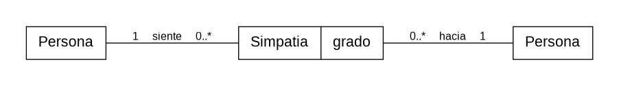

# Reto 001 – Modelado
## Escenario: Ser simpático

### Modelo

La **simpatía** se modela como una valoración que una `Persona` siente hacia otra.

No se considera que una persona sea simpática de forma absoluta: puede resultar simpática a unas personas y no a otras.

### Glosario

- **Persona:** individuo que puede valorar o ser valorado.
- **Simpatia:** valoración positiva que una persona siente hacia otra.
- **Grado:** intensidad de esa valoración.

### Supuestos

- La simpatía es subjetiva.
- Una persona puede parecer simpática a unas personas y no a otras.
- La relación tiene dirección: que A considere simpático a B no implica que B considere simpático a A.
- La simpatía puede cambiar con el tiempo.

### Decisiones de modelado

La simpatía no se representa con un atributo `simpatico = true/false` dentro de `Persona`, porque eso implicaría que ser simpático es una propiedad absoluta.

Se modela como un concepto intermedio entre dos personas: una persona **siente** una determinada `Simpatia` **hacia** otra.

De este modo, **alguien simpático** puede entenderse como una persona que recibe valoraciones positivas de simpatía por parte de otras personas.
