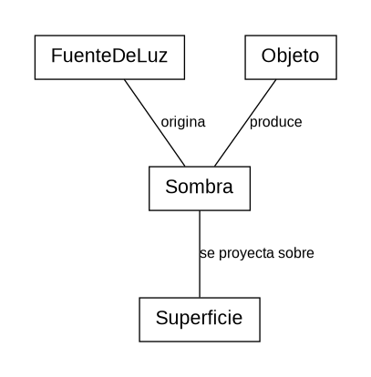

# Reto 001 – Modelado
## Escenario: Una sombra

### Modelo

Una sombra aparece cuando un **objeto** bloquea la luz procedente de una **fuente de luz** y se proyecta sobre una **superficie**.

### Glosario

- **FuenteDeLuz:** elemento que emite luz.
- **Objeto:** elemento que bloquea total o parcialmente la luz.
- **Sombra:** zona con menor iluminación producida por el bloqueo de la luz.
- **Superficie:** lugar sobre el que se proyecta la sombra.

### Supuestos

- Existe una fuente de luz.
- Existe un objeto que bloquea total o parcialmente la luz.
- Se modela una sombra proyectada sobre una superficie.
- No se tienen en cuenta fenómenos físicos complejos como reflexión o refracción.
- Un objeto puede producir distintas sombras si existen diferentes fuentes de luz.

### Decisiones de modelado

`Sombra` se representa como un concepto independiente y no como un atributo de `Objeto`, porque un mismo objeto puede producir varias sombras.

También se incluye `Superficie`, ya que se ha decidido modelar la sombra proyectada y observable.
