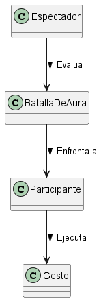

# Modelado del Dominio de las Batallas de Aura

## Iteración 1: Propuesta Base 
En esta primera propuesta recojo lo fundamental, a medida actualizo la propuesta base.

### Diagrama Base

### Glosario 
* **BatallaDeAura:** Pelea entre dos personas a base de gestos extraños.
* **Participante:** Una de las personas que compite en la batalla
* **Espectador:** Persona que dedica un tiempo a ver el espectaculo de la batalla

### Justificación de Decisiones
Estructura clara y concisa, un espectador evalua una batalla de aura en la que se enfrentan dos participantes haciendo gestos.

## Iteración 1
Añado los atributos a las entidades y también una entidad mas que considero que es importante el `lugar` donde se realiza.

### Diagrama Completo

### Glosario Brevísimo
* **Lugar:** Sitio en donde se hace la batalla.
* **Gesto:** Acción que se realiza para intentar ganar.

### Justificación de Decisiones
* **Clase (`Persona`):** Considero de ella se heredan participante y espectador, ya que, ambos son personas y hacen esos roles dependiendo de la situación.

---