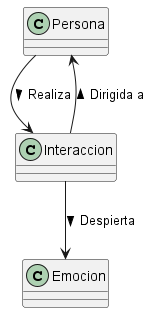
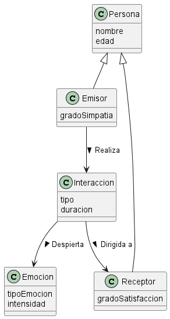

# Modelado del Dominio de la Empatía

## Iteración 1: Propuesta Base 
En esta primera propuesta recojo lo fundamental, a medida actualizo la propuesta base.

### Diagrama Base

### Glosario 
* **Persona:** Quien realiza la iteraccion.
* **Iteraccion:** Accion que realiza la persona para tratar de ser agradable con el receptor
* **Emocion:** Sentimiento que encuentra el receptor en mayor o menor grado

### Justificación de Decisiones
* **Modelado Basado en Interacción:** Se ha determinado que la simpatía no puede ser un atributo aislado de una única clase `Persona`. Físicamente, una persona no es simpática de forma autónoma si se encuentra sola. La simpatía es una propiedad puramente emergente y social; requiere obligatoriamente `Interaccion` orientada hacia otra persona para generar una `Emocion`. 

## Iteración 1
Añado los atributos a las entidades, y ciertas relaciones y una clase padre (`Persona`), de la que heredan `Emisor` y `Receptor`.

### Diagrama Completo

### Glosario 
* **Emisor:** Aquel que realiza la iteraccion.
* **Receptor:** Aquel que la recibe.

### Justificación de Decisiones
* **Clase (`Persona`):** Considero de ella se heredan emisor y espectador, ya que, tiene que ser una persona la que iteractua con otras.

---