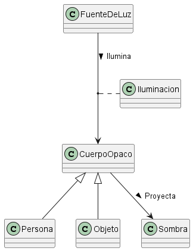
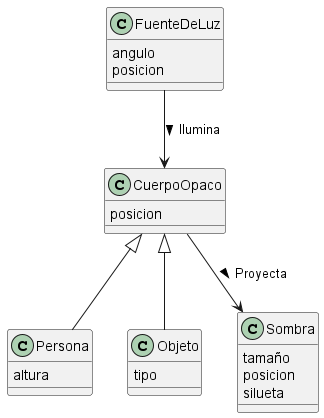
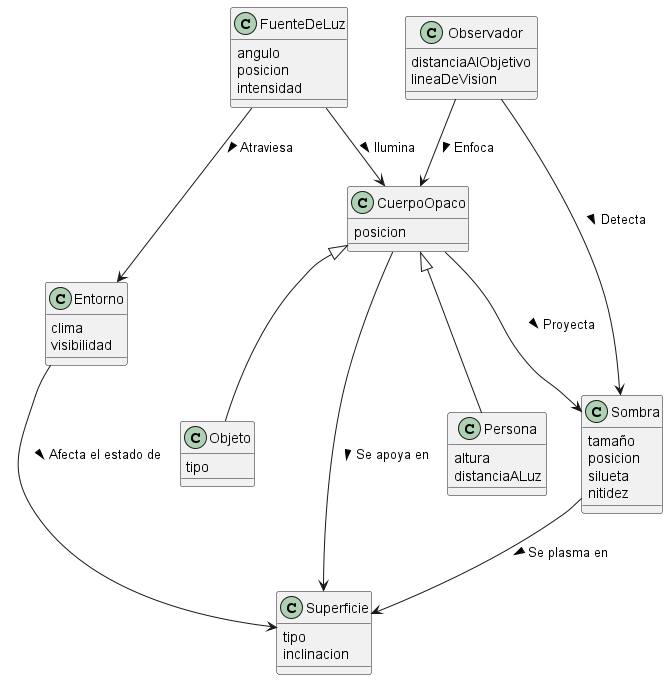

# Modelado del Dominio de la Sombra

## Iteración 1: Propuesta Base 
En esta primera propuesta recojo lo fundamental, a medida actualizo la propuesta base.

### Diagrama Base

### Glosario 
* **CuerpoOpaco:** Cualquier cuerpo que genera una sombra (edificio, persona, botella)
* **Sombra:** Silueta negra que se genera cuando un cuerpo opaco incide en una fuente de luz

### Justificación de Decisiones
* **Uso de Herencia:** Agrupe `Persona` y `Objeto` bajo la clase padre `CuerpoOpaco`, he evitado duplicar las relaciones semánticas de *"Ilumina"* y *"Proyecta"*.

* La clase `iluminacion` nace a partir de la relacion entre una fuente de luz incidiendo en un cuerpo opaco. Por eso la indico como una clase asociación en linea discontinua.

## Iteración 1
Me doy cuenta de que puedo añadir ciertos atributos a cada una de las clases para que quede aun mas claro.

### Diagrama 2

### Glosario 
* **Iluminacion:** Clase asociación que representa cuanta luz incide sobre el cuerpo opaco,
* **Silueta:** Atributo de la sombra que describe la forma de la misma.

### Supuestos Adoptados
* La `distancia` la asumo como una variable dinámica que cambia cuando se modifican las coordenadas de `posicion`.

### Justificación de Decisiones
* **Clase Asociación (`Iluminacion`):** Me doy cuenta de que la distancia no tiene sentido que vaya en la clase que resulta de la relacion entre `FuenteDeLuz` y `CuerpoOpaco`, ya que, es el cuerpo opaco el que esta a una distancia o a otra y que esta pueda variar.

## Iteración 2
En esta última iteración, busco darle el enfoque mas completo y rebuscado de todo el modelo de dominio.

### Diagrama 3

### Glosario 
* **Superficie:** Es el terreno fisico en donde se proyecta la luz, algun ejemplo es en una acera, en una pared...
* **Entorno:** Lo llamo a las diferentes condiciones meteorologicas que pueden ocurrir y que hacen que la luz incida de diferente manera en el cuerpo opaco.
* **Observador:** Camara encargada de hacer fotos a la sombra

### Supuestos Adoptados
* La `nitidez` de la sombra depende directamente de la `intensidad` de la luz y el estado del `clima` en el entorno.
* La sombra requiere obligatoriamente una `Superficie` con una `inclinacion` para poder manifestar y calcular su `tamaño` real en el plano.

### Justificación de Decisiones
* **Superficie:** Dependiendo de como se incline y del tipo de superficie en el que estemos la sombra puede variar mucho incluso con cambios de inclinación minimos (por lo que se ha tenido en cuenta esos atributos)
* **Observador:** Depende mucho de cuanta luz incida y del entorno para capturar la sombra, tal y como se ve en realidad.
