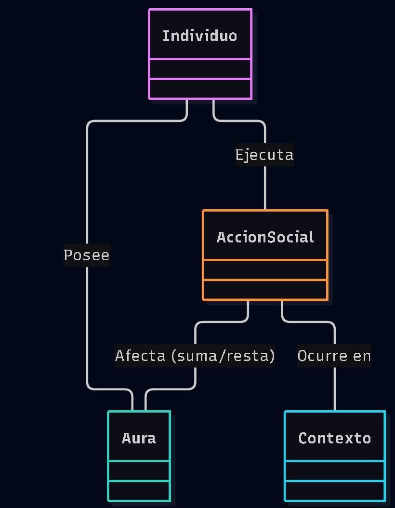

# Escenario 2: Farmear aura

## Diagrama de Dominio

## Glosario
* **Individuo:** La persona que interactúa socialmente y cuyo estatus está en juego.
* **Aura:** Una medida abstracta e intangible del carisma, respeto o "coolness" del individuo ante los demás.
* **AccionSocial:** Cualquier acto, comentario o comportamiento que el individuo realiza (ej. decir algo épico, o tropezarse en público).
* **Contexto:** El entorno físico o digital y los espectadores presentes. Una misma acción da o quita aura dependiendo de quién mire.

## Supuestos adoptados
* El "Aura" no es algo estático ni viene de nacimiento, es un valor dinámico que fluctúa (como la experiencia en un videojuego).
* Asumimos que para que haya un "farmeo" (o pérdida) de aura, la acción no ocurre en un vacío; requiere de un *Contexto* (otras personas o las redes sociales) que juzgue y valide el cambio de aura.
* "Farmear" implica realizar *Acciones Sociales* deliberadas con la intención de subir el medidor.

## Justificación de decisiones
* **¿Por qué añadir `Contexto`?**
  Farmear aura es un fenómeno puramente social. Caerse de las escaleras estando solo no te quita aura. Caerse frente a tu grupo de amigos sí. Por tanto, el *Contexto* es indispensable para que la *AccionSocial* tenga un efecto real sobre el *Aura*.