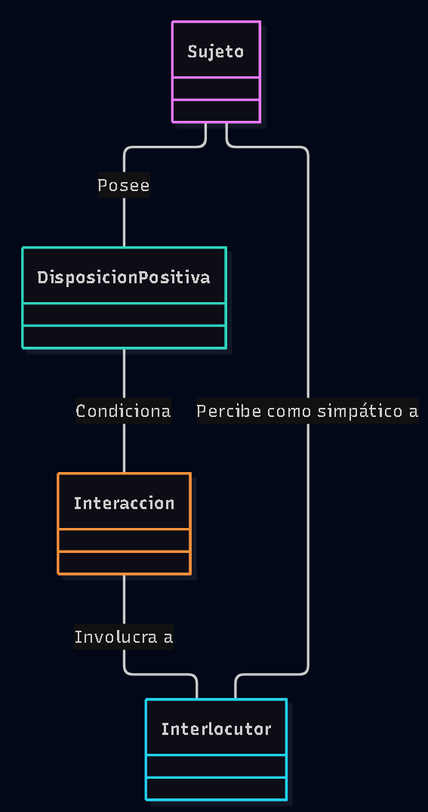

# Escenario 3: El concepto de simpatía

## Diagrama de Dominio

## Glosario
* **Sujeto:** La persona principal a la que intentamos definir o evaluar.
* **DisposicionPositiva:** Conjunto de actitudes intrínsecas del sujeto (ej. sonrisa, amabilidad, escucha activa, buen humor).
* **Interaccion:** El evento, conversación o cruce de miradas donde el sujeto se relaciona con el mundo.
* **Interlocutor:** La otra persona que recibe el trato del sujeto y emite un juicio de valor emocional.

## Supuestos adoptados
* La simpatía no existe en el vacío: es un concepto estrictamente relacional y dependiente de un observador/receptor.
* Se asume que la `DisposicionPositiva` es genuina y perceptible durante la interacción.
* Asumimos que el `Interlocutor` tiene un marco cultural y emocional compatible (lo que es simpático en una cultura podría no serlo en otra, por lo que el juicio del interlocutor es lo que valida la simpatía).

## Justificación de decisiones
* **¿Por qué no existe la clase `Simpatía` en el diagrama?**
  Porque "simpatía" no es un objeto ni una entidad estática. Es un **resultado**. Modelarlo como una clase independiente ("Sujeto tiene Simpatía") sería un error de análisis. La simpatía es la etiqueta que surge en la relación entre el *Sujeto* y el *Interlocutor*.
* **¿Por qué conectar al `Interlocutor` de vuelta con el `Sujeto`?**
  Porque el enunciado exige modelar algo "que permita definir a alguien simpático". La única forma de definir a alguien como simpático es que el *Interlocutor*, tras la interacción, emita esa evaluación sobre el *Sujeto*. Esa conexión cierra el ciclo y da respuesta exacta al requerimiento.