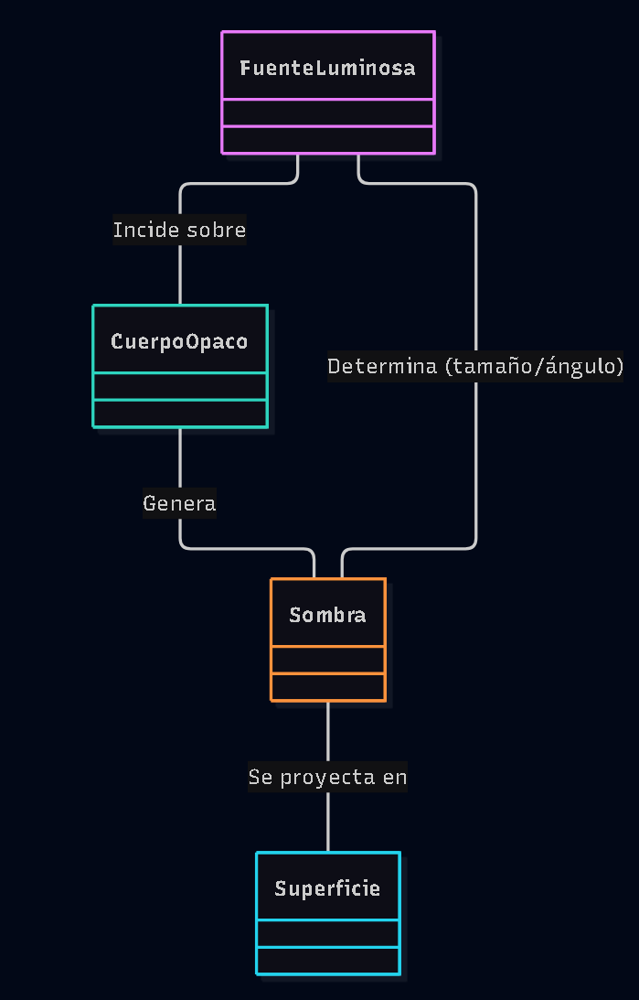

# Escenario 1: Una sombra

## Diagrama de Dominio

## Glosario
* **FuenteLuminosa:** Entidad que emite luz (ej. el Sol, una bombilla).
* **CuerpoOpaco:** Objeto físico material que bloquea el paso de la luz.
* **Sombra:** Área de oscuridad o silueta creada por la obstrucción de la luz.
* **Superficie:** El plano o entorno físico donde se hace visible (se plasma) la sombra.

## Supuestos adoptados
* Asumimos un entorno físico regido por leyes ópticas clásicas.
* Se asume que la intensidad de la `FuenteLuminosa` es lo suficientemente fuerte como para contrastar con el entorno, ya que si hubiera luz absoluta en todas direcciones, no habría sombra.
* Se asume que la distancia entre los tres elementos físicos es finita.

## Justificación de decisiones
* **¿Por qué llamar a la clase `CuerpoOpaco` y no simplemente `Objeto`?**
  En el dominio específico de "crear una sombra", un objeto cualquiera (como un cristal perfectamente transparente) no nos sirve. El dominio exige que la entidad tenga la capacidad de interrumpir la luz, por lo que llamarlo "CuerpoOpaco" (o traslúcido) añade precisión semántica al modelo sin complicarlo.
* **¿Por qué conectar `FuenteLuminosa` directamente con `Sombra`?**
  Alguien podría discutir que la luz nunca toca la sombra (porque la sombra es precisamente ausencia de luz). Sin embargo, a nivel conceptual y de modelado, la posición, cercanía e intensidad de la fuente de luz son las que *determinan* cómo es la sombra. Esa conexión directa es vital para entender las propiedades de la sombra final.