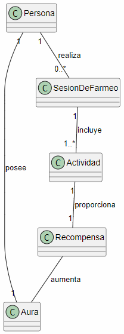

# Modelo del dominio: Farmear aura

## Diagrama de Aura

## Glosario

- **Persona:** quien realiza el farmeo.
- **Aura:** recurso que la persona quiere conseguir o aumentar.
- **SesionDeFarmeo:** periodo durante el cual la persona realiza actividades para conseguir aura.
- **Actividad:** acción realizada durante el farmeo.
- **Recompensa:** beneficio obtenido al realizar una actividad.

## Supuestos

- El aura se puede acumular.
- Una persona puede tener una cantidad de aura.
- Una persona puede realizar varias sesiones de farmeo.
- Una sesión contiene una o varias actividades.
- Las actividades proporcionan recompensas que aumentan el aura.

## Decisiones de modelado

**Sesion de farmeo** para representar que el farmeo no es una única acción, sino un conjunto de actividades realizadas durante un periodo.