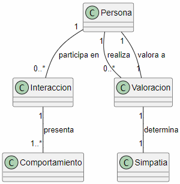

# Modelo del dominio: El concepto de simpatía

## Diagrama de Simpatía

## Glosario

- **Persona:** individuo que participa en una interacción.
- **Interaccion:** situación en la que participan una o más personas.
- **Comportamiento:** forma de actuar de una persona durante una interacción.
- **Valoracion:** opinión de una persona sobre otra.
- **Simpatia:** percepción positiva que una persona puede tener sobre otra.

## Supuestos

- La simpatía depende de la percepción de otras personas.
- Una persona puede ser considerada simpática por una persona y no por otra.
- Las interacciones permiten observar comportamientos.
- Los comportamientos pueden influir en la valoración de una persona.

## Decisiones de modelado

La **Simpatia** se considera como una característica fija de una persona. la cual depende de las valoraciones realizadas por otras personas.

