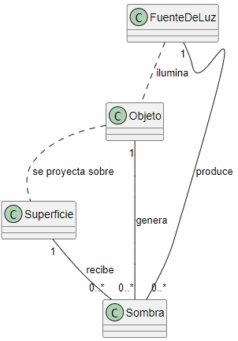

# Modelo del dominio: Una sombra

## Diagrama de Sombra

## Glosario

- **FuenteDeLuz:** elemento que produce luz.
- **Objeto:** elemento que puede bloquear la luz.
- **Superficie:** lugar donde se proyecta la sombra.
- **Sombra:** zona de una superficie donde la luz queda bloqueada.

## Supuestos

- Para que exista una sombra tiene que haber una fuente de luz y un objeto.
- La sombra se refleja sobre una superficie.
- Una fuente de luz puede producir varias sombras.
- Un objeto puede generar sombras sobre diferentes superficies.

## Decisiones de modelado

La **Sombra** se considera como un concepto independiente porque depende de la fuente de luz, del objeto y de la superficie.