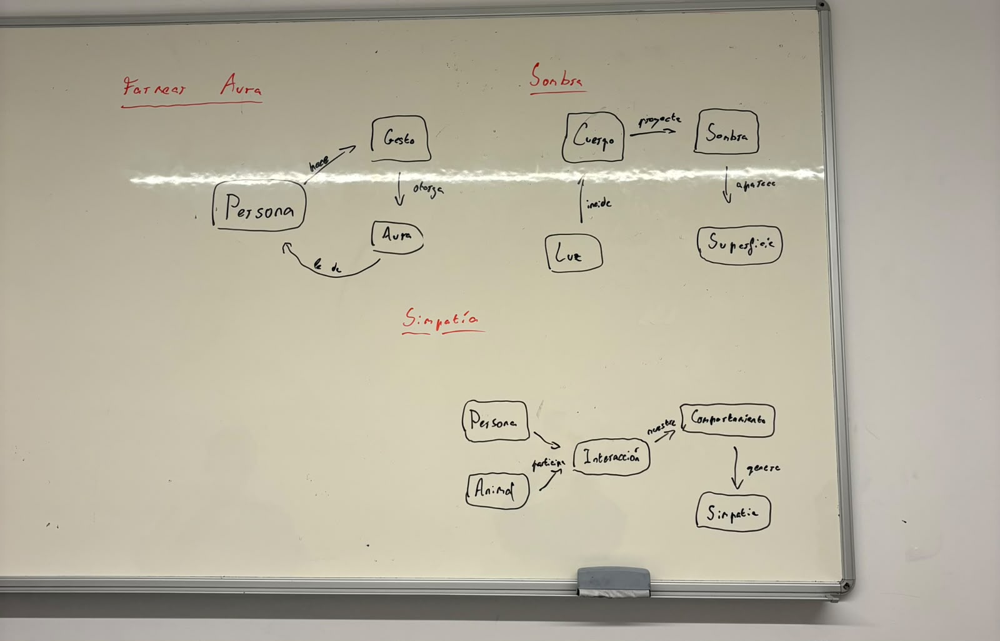
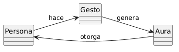
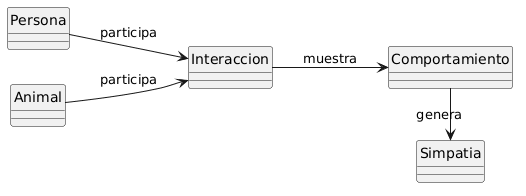
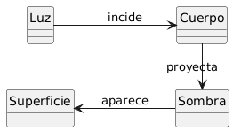

# Reto-001

Esta es mi solución al reto 001, en donde se hacen tres modelos del dominio (sombra, simpatía y farmear aura). El planteamiento se hizo en grupo, en donde en conjunto trabajamos y llegamos a una conclusión sobre los diagramas en la pizarra.

## 1. Farmear aura

Esta solución se basa en un ciclo de una persona haciendo diferentes gestos, cada cual le otorga aura, así indefinidamente.

La persona hace un gesto, este gesto genera un aura y luego esta aura es otorgada a la persona. Creo que este modelo es bastante autoexplicativo y que los términos utilizados son correctos y no dan lugar a ambigüedad en este caso.

## 2. Simpatía

El modelo de simpatía fue algo más difícil. Primero hay que analizar quién es capaz de sentir simpatía: ¿todo ser vivo?, ¿los animales y los humanos?, ¿o solo los humanos? Se concluye que tanto los humanos como los animales son capaces de expresar simpatía, pues ambos son capaces de mostrar empatía.

El flujo es el siguiente: la persona o animal participan en una interacción; en esa interacción se muestra un comportamiento que luego genera simpatía. 

## 3. Sombra

El ejercicio de la sombra fue más complicado en cuanto a encontrar términos adecuados, pues no se puede simplemente poner "objeto" o "humano", ya que no son lo mismo. Optamos por usar el término "cuerpo" para referirse a algo que proyecte una sombra. 

La luz incide en un cuerpo; este cuerpo refleja y absorbe parte de la luz (asumimos que el cuerpo no es transparente). Luego, este cuerpo proyecta una sombra, es decir, la silueta de la falta de luz que luego aparece en una superficie.