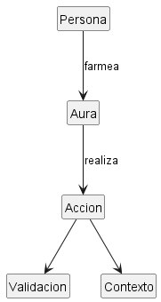

## Escenario: Farmear aura

### Modelo

El modelo se representa en el diagrama `farmearAura.puml`.

Se entiende **farmear aura** como realizar acciones que producen una percepción social favorable sobre una persona. El aura no se considera una propiedad objetiva: depende de quién observa las acciones y de cómo las valora.

Una `Persona` realiza una `Accion`; otras personas pueden observarla mediante una `Observacion`. A partir de esas observaciones se forma una `AuraPercibida` sobre la persona que realizó las acciones.

## Diagrama de Farmear Aura

### Glosario

- **Persona:** individuo que realiza u observa acciones.
- **Accion:** comportamiento realizado por una persona.
- **Observacion:** percepción y valoración de una acción por otra persona.
- **AuraPercibida:** impresión social que un observador mantiene sobre otra persona.
- **Contexto:** circunstancias en las que ocurre una acción.

### Supuestos

- El aura se interpreta como una percepción social, no como una propiedad física.
- Una misma acción puede ser valorada de manera distinta por observadores diferentes.
- El contexto puede cambiar la interpretación de una acción.
- Una acción puede aumentar, reducir o no modificar el aura percibida.
- Farmear aura no exige necesariamente que todas las acciones tengan éxito ni que todos los observadores reaccionen igual.

### Decisiones de modelado

`AuraPercibida` no se modela como un único número perteneciente a `Persona`, porque eso convertiría una percepción subjetiva en una propiedad absoluta. En el modelo, cada observador puede mantener una percepción diferente sobre la misma persona.

`Observacion` se modela explícitamente porque conecta una acción concreta con la valoración de quien la presencia. De este modo puede representarse que la misma acción produzca impactos diferentes.

En este modelo, **farmear aura** es un comportamiento derivado: una persona farmea aura cuando realiza acciones cuyas observaciones tienden a mejorar su `AuraPercibida`.
