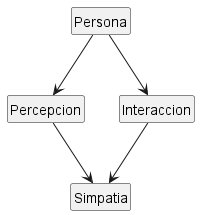

## Escenario: El concepto de simpatía

### Modelo

El modelo se representa en el diagrama `simpatia.puml`.

La **simpatía** se modela como una valoración que una `Persona` realiza sobre otra. Por tanto, no se considera que una persona sea simpática de forma absoluta: puede resultar simpática a unas personas y no a otras.

Las `Interaccion` entre personas pueden influir en una `ValoracionDeSimpatia`. Cada valoración tiene un evaluador, una persona evaluada y un grado.

Con este modelo, **alguien simpático** puede definirse como una persona que recibe valoraciones de simpatía positivas dentro de un grupo o contexto de referencia.

## Diagrama de Simpatía

### Glosario

- **Persona:** individuo que puede evaluar o ser evaluado.
- **Interaccion:** encuentro o comunicación entre personas.
- **ValoracionDeSimpatia:** percepción de una persona sobre el grado de simpatía de otra.
- **Grado:** intensidad de la valoración de simpatía.

### Suposiciones

- La simpatía es subjetiva.
- La relación tiene dirección: que A considere simpático a B no implica que B considere simpático a A.
- La simpatía puede cambiar a partir de nuevas interacciones.
- Una misma persona puede recibir valoraciones diferentes.
- La expresión «alguien simpático» necesita un grupo o contexto de referencia; no se considera una propiedad universal.

### Decisiones de modelado

La simpatía no se representa mediante un atributo `simpatico = true/false` en `Persona`, porque una misma persona puede ser valorada de forma diferente por distintos individuos.

`ValoracionDeSimpatia` se modela como un concepto propio porque necesita representar quién evalúa, quién es evaluado y con qué grado.

Las `Interaccion` se incluyen porque proporcionan hechos del dominio que pueden influir en las valoraciones. No se establece que una sola interacción determine automáticamente la simpatía.

La expresión **«alguien simpático»** se trata como una definición derivada de las valoraciones recibidas en un contexto de referencia, y no como una característica absoluta de la persona.
