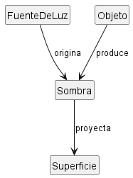

## Escenario: Una sombra

### Modelo

El modelo se representa en el diagrama `sombra.puml`.

Se considera una **sombra proyectada** como el resultado de que un `Objeto` bloquee la luz procedente de una `FuenteDeLuz`, produciendo una zona menos iluminada sobre una `Superficie`.

Una misma fuente puede originar muchas sombras y un mismo objeto puede provocar sombras distintas si intervienen diferentes fuentes de luz.

## Diagrama de Sombra

### Glosario

- **FuenteDeLuz:** elemento que emite la luz.
- **Objeto:** elemento que bloquea total o parcialmente la luz.
- **Sombra:** zona de menor iluminación originada por el bloqueo de la luz.
- **Superficie:** lugar sobre el que se proyecta la sombra.

### Supuestos

- Se modela una sombra proyectada y observable sobre una superficie.
- Cada sombra concreta corresponde a una fuente de luz, un objeto y una superficie.
- Un objeto puede generar varias sombras cuando existen varias fuentes de luz.
- No se modelan reflexión, refracción ni otros fenómenos ópticos complejos.
- La posición relativa de los elementos puede modificar la forma, tamaño e intensidad de la sombra.

### Decisiones de modelado

`Sombra` se modela como un concepto independiente y no como un simple atributo de `Objeto`. La razón es que un mismo objeto puede producir varias sombras y cada una puede tener características diferentes.

También se incluye `Superficie`, porque se ha decidido modelar la sombra proyectada y observable. Si se quisiera modelar el fenómeno físico completo, podría considerarse también la región tridimensional del espacio en la que la luz queda bloqueada.
