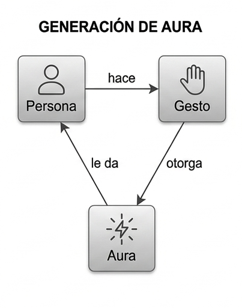

# Reto 001 — Modelado: Farmear aura

## 1. Farmear aura

"Farmear aura" consiste en hacer cosas que mejoren la imagen que los demás tienen de uno, por ejemplo mediante gestos o efectos de sonido. Puede hacerse de forma deliberada, buscando quedar bien, o suceder sin intención como efecto de la manera en que alguien se comporta en cada situación.

### Supuestos
* El aura no es algo físico ni medible; es la imagen o reputación que los demás se forman de una persona.
* Una misma acción puede subir el aura ante unos observadores y bajarla ante otros, porque cada quien juzga con sus propios criterios.
* El contexto influye: una acción no produce el mismo efecto en todos los lugares ni en todos los momentos.
* No existe una fórmula para calcular el aura; es un concepto subjetivo y cambiante.
* Quien percibe la acción es siempre una persona distinta de quien la realiza.

### Glosario
* **Persona**: Cualquier individuo; puede realizar acciones o ver cómo otros las realizan.
* **Aura**: Imagen o reputación que los demás tienen de una persona, y que puede subir o bajar.
* **Acción**: Algo concreto que hace una persona y que otros pueden observar, como un gesto o un efecto de sonido.
* **Situación**: Contexto en el que ocurre una acción: dónde, cuándo y con quién.

### Decisiones discutibles
* **`Aura` como concepto propio**: Se podría haber representado como un número dentro de `Persona`, como una puntuación. Pero el aura no la tiene la persona por sí sola: depende de cómo la perciben los demás.
* **Sin concepto `Observador`**: La relación `Acción -> Persona : es percibida por` indica que quien ve la acción es otra persona. Un observador no deja de ser una persona, así que crear una clase aparte complicaría el modelo sin aportar nada nuevo.
* **`Situación` como concepto propio**: No es un dato que "tenga" la acción, sino un escenario externo que puede afectar a varias acciones a la vez.
