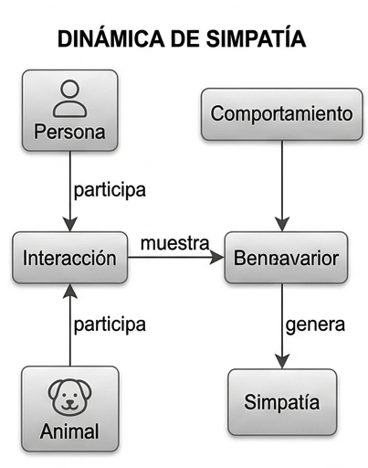

# Reto 001 — Modelado: El concepto de simpatía

## 1. El concepto de simpatía

Decir que alguien es simpático no es algo absoluto: depende de quién lo diga. Por eso, en lugar de usar "simpático" como una etiqueta fija, el modelo representa la simpatía como un sentimiento que un ser tiene hacia otro y que puede cambiar con el tiempo según cómo interactúen.

### Supuestos
* La simpatía no es una propiedad de un ser, sino de la relación entre dos seres, sean personas o animales.
* Que A encuentre simpático a B no implica que B encuentre simpático a A.
* La simpatía cambia con el tiempo: una mala interacción puede reducirla y una buena, aumentarla.
* Las interacciones influyen en la simpatía, pero no la determinan de forma fija.
* No existe un umbral exacto para ser "simpático"; cada quien tiene su propio criterio.

### Glosario
* **Persona**: Individuo que puede relacionarse con otros.
* **Animal**: Ser vivo que también puede participar en una interacción y generar simpatía.
* **Simpatía**: Sensación positiva que un ser siente hacia otro; varía en intensidad y con el tiempo.
* **Interacción**: Encuentro o conversación entre seres.
* **Comportamiento**: Forma de actuar durante una interacción.
* **Contexto**: Circunstancias que rodean la interacción: lugar, momento, situación.

### Decisiones discutibles
* **Definición de "alguien simpático"**: No se creó una entidad aparte; "alguien simpático" es cualquier persona o animal cuyo comportamiento en una interacción provoca simpatía en otro ser.
* **Inclusión de `Animal`**: Aunque en modelado social suele usarse solo personas, un animal también participa en interacciones y puede generar simpatía.
* **Sin concepto `Simpático`**: "Simpático" no es un tipo de ser, sino una opinión que alguien tiene sobre otro.