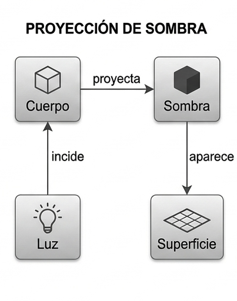

# Reto 001 — Modelado: Una sombra

## 1. Una sombra

Una sombra se forma cuando algo se interpone en la trayectoria de la luz antes de que llegue a una superficie. El modelo busca representar esa situación con la menor cantidad de conceptos posible, sin perder la idea de que la sombra depende de otros elementos para existir.

### Supuestos
* La sombra es un fenómeno que surge de una situación concreta, no un objeto con existencia propia e independiente.
* Para que aparezca deben coincidir tres elementos al mismo tiempo: una fuente de luz, un objeto que la bloquee y una superficie donde se proyecte. Si falta alguno, no hay sombra visible.
* Si existen varias fuentes de luz, un mismo objeto puede proyectar varias sombras a la vez, una por cada fuente.
* Se asume que el objeto es opaco, es decir, que bloquea por completo el paso de la luz.
* No se consideran efectos como la penumbra o la refracción.

### Glosario
* **Fuente de luz**: Todo aquello que emite luz, como el sol, una lámpara o una vela. Es el origen del proceso.
* **Objeto**: Cualquier cuerpo opaco que se interpone y evita que la luz continúe su camino.
* **Sombra**: Zona más oscura que se forma sobre una superficie cuando un objeto bloquea la luz, y que contrasta con las zonas que sí reciben luz.
* **Superficie**: Lugar donde la sombra se hace visible, como el suelo, una pared o una mesa.

### Decisiones discutibles
* **`Sombra` como concepto propio**: Podría pensarse que la sombra es simplemente algo que un objeto tiene o no tiene, como un atributo. Sin embargo, la sombra no pertenece al objeto: nace de la relación entre la luz, el objeto y la superficie.
* **Sin relación directa `Fuente de luz -> Sombra`**: A primera vista parece lógico que la luz cause la sombra, pero sin un objeto que la bloquee no existiría ninguna. El diagrama sigue el recorrido `Fuente de luz -> Objeto -> Sombra`.
* **Fenómenos descartados**: Se dejaron fuera la penumbra, la refracción y otros efectos ópticos para mantener el modelo centrado en lo esencial.
