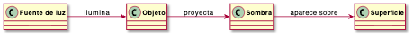

[🏠 README](../README.md) · [→ Siguiente: Farmear aura](02_farmearAura.md)

---

# Reto 001 — Modelado: Una sombra

## 1. Modelo de dominio

Una sombra aparece cuando algo bloquea la luz antes de que llegue a alguna superficie. Para que haya sombra hacen falta tres cosas: una fuente de luz, algo que la tape y una superficie donde se vea el resultado.

El modelo identifica cuatro conceptos:

- **Fuente de luz**
- **Objeto**
- **Sombra**
- **Superficie**

## 2. Glosario

| Término | Definición |
|---|---|
| **Fuente de luz** | Lo que emite luz: el sol, una lámpara, una vela… |
| **Objeto** | Cualquier cosa que bloquea el paso de la luz. |
| **Sombra** | La zona oscura que aparece cuando la luz queda bloqueada. |
| **Superficie** | El sitio donde se ve la sombra: el suelo, una pared… |

## 3. Supuestos

1. Para que exista sombra hacen falta los tres elementos: luz, objeto y superficie.
2. Un mismo objeto puede producir varias sombras si hay varias fuentes de luz.
3. No se tienen en cuenta efectos raros de la luz como la penumbra o la refracción.

## 4. Decisiones de modelado

**¿Por qué `Sombra` es un concepto propio y no una propiedad del objeto?** Podría pensarse que la sombra es simplemente algo que tiene o no tiene un objeto. Pero eso no es correcto: la sombra no pertenece al objeto, sino que es el resultado de la relación entre los tres elementos. Por eso tiene sentido tratarla como un concepto independiente en el diagrama.

**¿Por qué no hay flecha directa entre `Fuente de luz` y `Sombra`?** Aunque intuitivamente la luz "causa" la sombra, en realidad no puede haberla sin un objeto que la tape. El objeto es el paso obligatorio en esa cadena. Por eso el diagrama va de fuente de luz → objeto → sombra, que refleja mejor lo que realmente ocurre.

---

[🏠 README](../README.md) · [→ Siguiente: Farmear aura](02_farmearAura.md)
