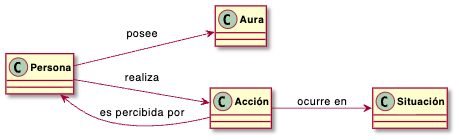

[← Anterior: Una sombra](01_sombra.md) · [🏠 README](../README.md) · [→ Siguiente: El concepto de simpatía](03_simpatia.md)

---

# Reto 001 — Modelado: Farmear aura

## 1. Modelo de dominio

"Farmear aura" significa hacer cosas que hacen que los demás te vean mejor. Puede ser algo consciente (quedar bien adrede) o simplemente el efecto de cómo actúas en cada situación.

Los conceptos principales son:

- **Persona**
- **Aura**
- **Acción**
- **Situación**

> **Nota:** En el diagrama, la flecha `Acción → Persona : es percibida por` indica que quien ve la acción es una persona distinta de quien la realiza. No hace falta crear un concepto separado para "observador" porque un observador no deja de ser una persona.

## 2. Glosario

| Término | Definición |
|---|---|
| **Persona** | Cualquier individuo; puede hacer cosas o verlas hacer. |
| **Aura** | La imagen o reputación que los demás tienen de una persona. |
| **Farmear aura** | Hacer cosas para que tu aura suba. |
| **Acción** | Algo concreto que hace una persona y que otros pueden ver. |
| **Situación** | El contexto en el que ocurre una acción (dónde, cuándo, con quién). |

## 3. Supuestos

1. El aura no es algo físico; es lo que otros piensan de ti.
2. Una misma acción puede subir el aura para unos y bajarla para otros.
3. El contexto importa: la misma acción no tiene el mismo efecto en todos los sitios.
4. No existe una fórmula para calcular el aura; es algo subjetivo.

## 4. Decisiones de modelado

**¿Por qué `Aura` es un concepto propio y no un simple número dentro de `Persona`?** Se podría haber puesto el aura como un valor dentro de la persona (como si fuera una puntuación). Pero el aura no es algo que tenga la persona por sí sola: depende de lo que hacen otros al percibirla. Tratarla como concepto independiente refleja mejor esa idea.

**¿Por qué no hay un concepto `Observador`?** Un observador es simplemente otra persona que ve lo que haces. Añadir una clase separada para eso complicaría el diagrama sin aportar nada nuevo.

**¿Por qué `Situación` es un concepto propio y no un dato de la acción?** Porque la situación es algo externo que puede afectar a varias acciones a la vez. No es algo que "tenga" la acción, sino el escenario en el que ocurre.

---

[← Anterior: Una sombra](01_sombra.md) · [🏠 README](../README.md) · [→ Siguiente: El concepto de simpatía](03_simpatia.md)
