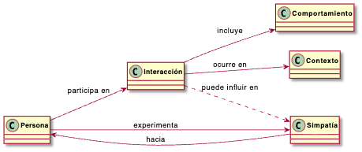

[← Anterior: Farmear aura](02_farmearAura.md) · [🏠 README](../README.md)

---

# Reto 001 — Modelado: El concepto de simpatía

## 1. Modelo de dominio

Decir que alguien es simpático no es algo absoluto: depende de quién lo diga. Por eso, en vez de poner "simpático" como una etiqueta fija, se modela la simpatía como algo que una persona siente hacia otra, y que puede cambiar con el tiempo según cómo interactúen.

Los conceptos principales son:

- **Persona**
- **Simpatía**
- **Interacción**
- **Comportamiento**
- **Contexto**

> **Nota:** En el diagrama, la simpatía va de una persona hacia otra: A siente simpatía hacia B. Esto permite que A encuentre a B simpático aunque B no sienta lo mismo hacia A.

## 2. Glosario

| Término | Definición |
|---|---|
| **Persona** | Cualquier individuo que puede relacionarse con otros. |
| **Simpatía** | La sensación positiva que una persona tiene hacia otra. Puede ser mayor o menor, y cambia con el tiempo. |
| **Interacción** | Un encuentro o conversación entre personas. |
| **Comportamiento** | Cómo actúa una persona durante una interacción. |
| **Contexto** | Las circunstancias que rodean una interacción: el lugar, el momento, la situación… |

## 3. Supuestos

1. La simpatía no es una propiedad de la persona, sino de la relación entre dos personas.
2. Que A encuentre simpático a B no significa que B encuentre simpático a A.
3. La simpatía puede cambiar: una mala interacción puede reducirla, y una buena puede aumentarla.
4. Las interacciones influyen en la simpatía, pero no la determinan de forma fija.
5. No existe un punto exacto a partir del cual alguien es "simpático": cada persona tiene su propio criterio.

## 4. Decisiones de modelado

**¿Por qué `Simpatía` es un concepto propio y no una etiqueta de `Persona`?** Podría haberse dicho simplemente "esta persona es simpática: sí/no". Pero eso no refleja la realidad: que tú me caigas bien a mí no significa que le caigas bien a todos. La simpatía existe entre dos personas, no dentro de una sola. Por eso se modela como algo que conecta a una persona con otra.

**¿Por qué hay una flecha punteada entre `Interacción` y `Simpatía`?** Porque las interacciones influyen en la simpatía, pero no siempre del mismo modo ni para todos. Es una influencia posible, no una consecuencia garantizada. Sin esta conexión, el diagrama quedaría partido en dos partes sin relación entre sí.

**¿Por qué no existe un concepto `Simpático`?** Porque "simpático" no es un tipo de persona, es una opinión que alguien tiene sobre otra. Crear un concepto así sería como decir que hay personas que son simpáticas de forma universal, y eso contradice todo el modelo.

---

[← Anterior: Farmear aura](02_farmearAura.md) · [🏠 README](../README.md)
