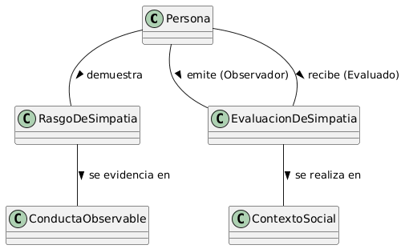

# Escenario 3. El Concepto de la empatía

## Esquema

## Glosario de Términos

- **Persona**: Ente social que puede ser evaluado por su simpatía o actuar como observador de otros.
- **Rasgo de Simpatía:** Atributo abstracto de la personalidad asociado a ser simpático (ej. calidez, sentido del humor, empatía).
- **Conducta Observable:** Acción concreta y perceptible que sirve de evidencia objetiva de un rasgo.
- **Contexto Social:** Ámbito o entorno (laboral, festivo, casual) donde se manifiestan y juzgan las conductas.
- **Evaluación de Simpatía:** Juicio o percepción subjetiva que emite un observador sobre la simpatía de otra persona en un contexto determinado.

## Supuestos Adoptados

Inclusión explícita de **ContextoSocial**:

- Justificación: Un chiste pesado puede sumar simpatía en una juntada con amigos (ContextoSocial: FESTIVO), pero restar dramáticamente en una entrevista de trabajo (ContextoSocial: LABORAL). El contexto modifica el impacto de la conducta observable.

Vinculación directa entre **Evaluación y Contexto:**

- Justificación: Se mantiene la premisa de que la simpatía es relacional y contextual: una misma conducta puede ser valorada como "simpática" en un contexto informal pero "inapropiada" en uno formal.