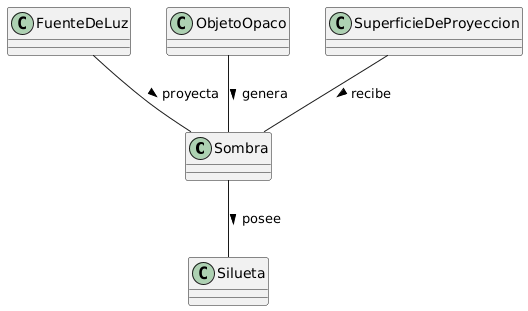

# Escenario 1. Una sombra

## Esquema

## Glosario de Términos

- Sombra: Región de oscuridad o penumbra que se produce en un espacio determinado cuando un objeto interrumpe el paso directo de los rayos de luz.
- Fuente de Luz: Elemento emisor de radiación luminosa (ej. el Sol, una linterna, una vela) necesario para generar la iluminación.
- Objeto Opaco: Cuerpo físico no transparente que se interpone en la trayectoria de la luz bloqueándola parcial o totalmente.
- Superficie de Proyección: Soporte físico o plano (ej. el suelo, una pared, una pantalla) sobre el cual impacta la luz no bloqueada y se visualiza la sombra.
- Silueta: Contorno o figura geométrica bidimensional proyectada, resultado de la deformación lineal del objeto según el ángulo y distancia de la luz.

## Supuestos Adoptados

Independencia de la Sombra por Fuente de Luz:

- Justificación: Si hay tres luces apuntando a una persona, se perciben tres sombras distintas con diferentes ángulos e intensidades. Por eso, cada Sombra surge de la combinación exacta de una sola fuente, un solo objeto y una sola superficie.

Abstracción de la Silueta como entidad compositiva:

- Justificación: La forma de la sombra no es idéntica a la forma del objeto; depende de la perspectiva, la inclinación de la superficie y la distancia de la luz. Separar la Silueta de la Sombra permite modelar la deformación óptica de manera independiente.

Exclusión de penumbras o sombras secundarias como entidades separadas:

- Justificación: Para mantener el modelo acotado a 5 entidades, los matices entre "umbra" y "penumbra" se modelan como atributos de calidad (nitidezBorde e intensidadOscuridad) dentro de la entidad Sombra.